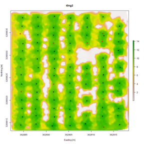
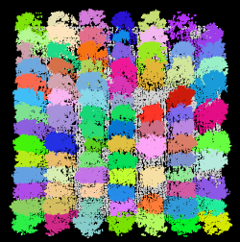
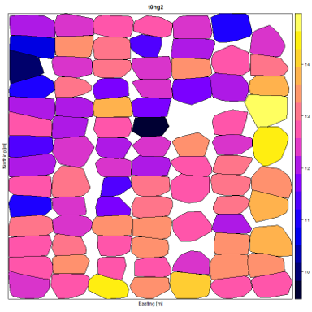

# interactive-itd
Automated individual tree detection with interactive quality control in R.

## Overview
This script is a workflow that adds user interaction for quality control purposes to automated individual tree detection (ITD) algorithms available in the [lidR package for R](https://github.com/r-lidar/lidR). The user can inspect the automated ITD results and edit locations of detected treetops while the script is active, and the QC'd data is what is then used for further processing of tree count, tree height, and crown metrics. Manual corrections of the automated data allows for an operator to use their judgment and their knowledge of the study area to correct for Type I and Type II errors in tree detection.

## Input data
The script takes in an LAS file that has been classified (ground and non-ground) and normalized for height above ground. A number of software packages can perform these processing steps (e.g. [LASTools](https://rapidlasso.com/lastools/)). The path and filename for the input data are edited directly in the script.

## Example output data

The script compiles the following metrics and outputs them to a CSV.
```
treeID  Z       npoints  convhull_area  treeID  Z_smooth     X          Y
1       11.979  439      3.6587475      1       11.70115215  362919.45  3288817.35
2       13.51   729      5.622896       2       12.93249749  362916.15  3288816.55
3       13.337  938      5.330518501    3       12.85790289  362912.55  3288816.45
4       13.984  1035     5.6456425      4       13.35739845  362923.65  3288816.35
5       13.35   1044     7.674374       5       12.8961552   362934.35  3288816.25
6       14.153  1014     6.8967845      6       13.77875495  362927.25  3288816.15
7       14.517  1258     6.7030015      7       13.88873395  362930.85  3288815.95
8       12.817  1006     6.278967001    8       12.35729429  362916.35  3288814.55
9       11.855  1137     7.3396835      9       11.65258282  362919.55  3288814.45
10      12.749  882      6.057846       10      12.52574992  362930.85  3288814.45 
```



*ITD results over a canopy height model. Automatically detected treetop positions in black and user edited/detected treetops in red.*



*Point cloud of forest subplot with randomly-colored segments showing detected trees (lidR output).*



*Convex hull fitting results with area shown by color scale (lidR output).*

## Acknowledgements

This work was supported by member companies of the University of Florida Forest Biology Research Cooperative (http://www.sfrc.ufl.edu/fbrc/) and U.S. Geological Survey Research Work Order #300.